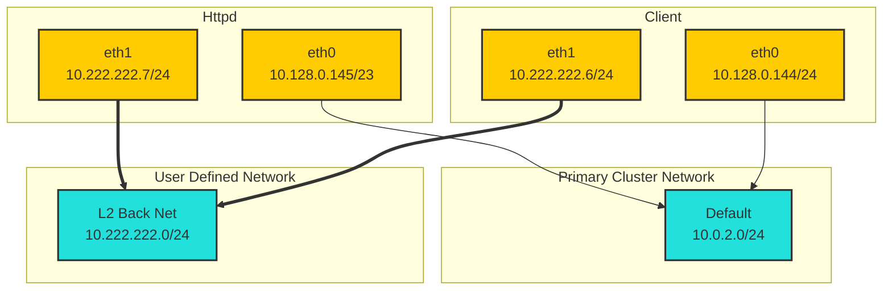
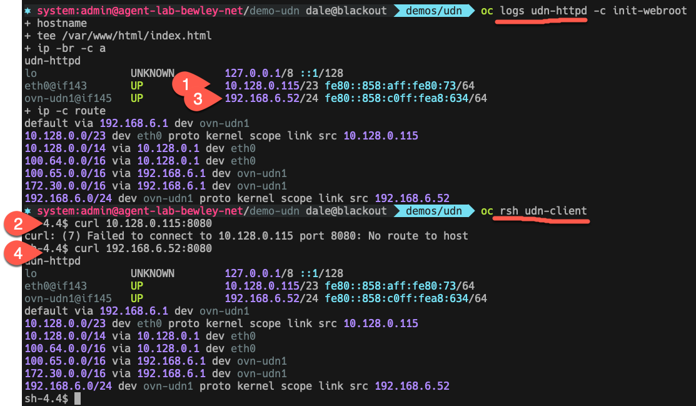

# Test User Defined Networks

Right now just testing with plain containers rather than VMs.

## Quick Deploy 

```bash
oc apply -k .
```

## Detailed Deploy

* Install OCP 4.18 ec3

* Enable UDN with [this job](../../networking/components/enable-udn/)

* Create a [Layer2 UDN](../../networking/components/l2-back/udn/udn.yaml) in demo-udn namespace

```yaml
apiVersion: k8s.ovn.org/v1
kind: UserDefinedNetwork
metadata:
  name: l2-back
spec:
  topology: Layer2
  layer2:
    ipamLifecycle: Persistent
    role: Primary
    subnets:
      - 10.222.222.0/24
```

* Create 2 [pods](pod.yaml) in demo-udn namespace

* View logs on the pods

* `oc rsh` to the client pod and curl the httpd pod on port 8080

## Diagram



## Observations

* the pods have 2 interfaces automatically. "look ma, no multus!"
* eth0 is on the cluster network 10.128.0.0/14
* eth1 is given an IP on the range associated with the Layer 2 UDN
* pods can only contact each other over eth1 😕

