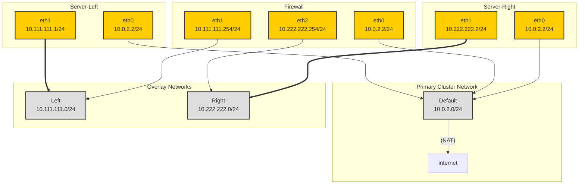

# VMs with Firewall Demo

Testing of L2 overlay networks

[Front Net](components/l2-front) will have [Left Server](../../components/vms/server-left) attached at `10.111.111.1/24`

[Back Net](components/l2-back) will have [Right Server](../../components/vms/server-right) attached at `10.222.222.2/24`

[Firewall Server](../../components/vms/firewall) will be attached to both at `10.111.111.254` and `10.222.222.254`

Left and Right servers will have a static route defined allowing them to ping either other through the Firewall. 

Each server will be scheduled to a unique node through the use of an [AntiAffinity rule](patch-vm-affinity.yaml) based on hypervisor node hostname.

Networking is configured at boot by [this script](scripts/netsetup).

Currently, most of the VM configuration is applied via inline patches in [kustomization.yaml](kustomization.yaml)

