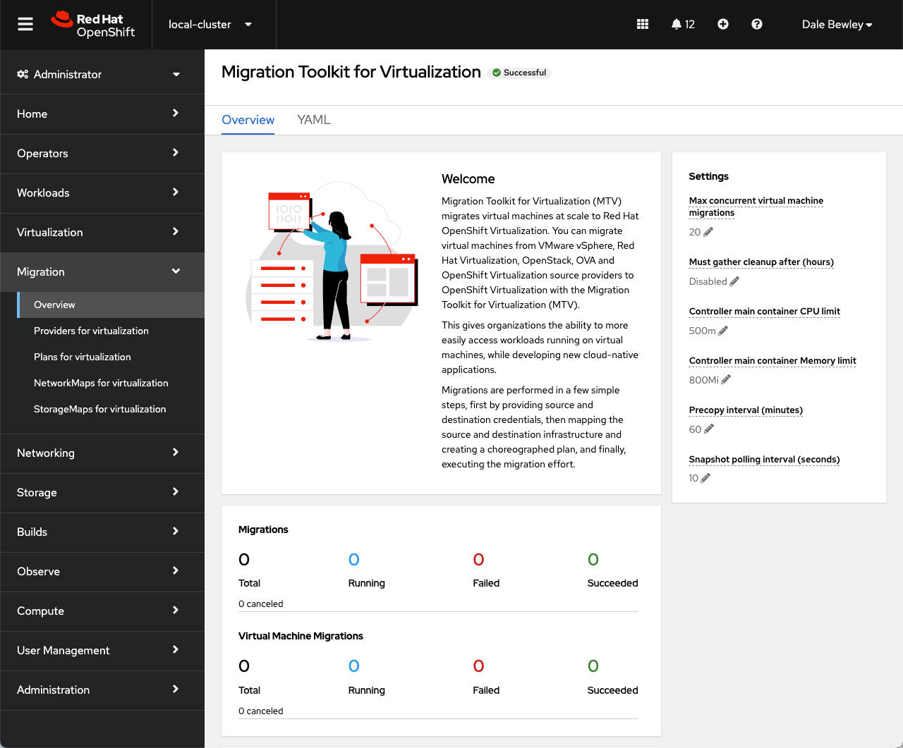
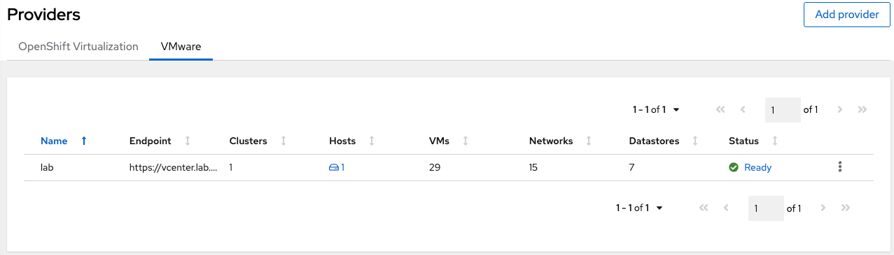
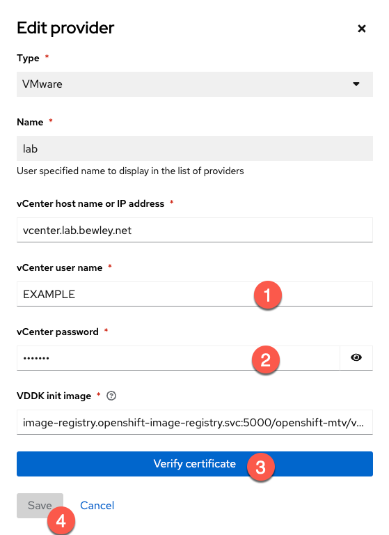
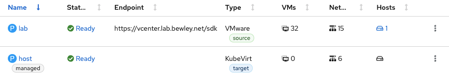
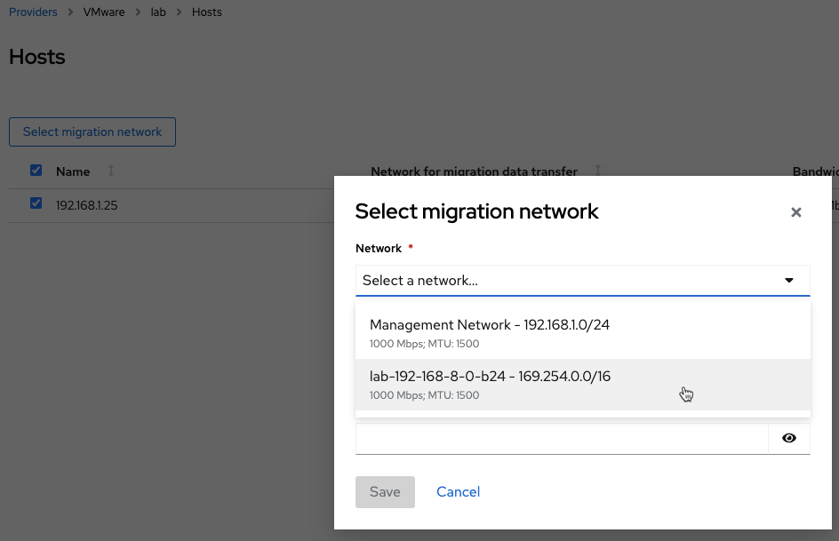
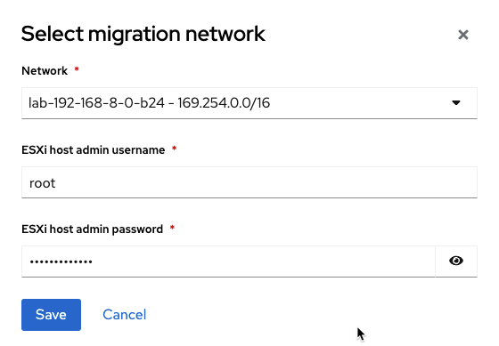
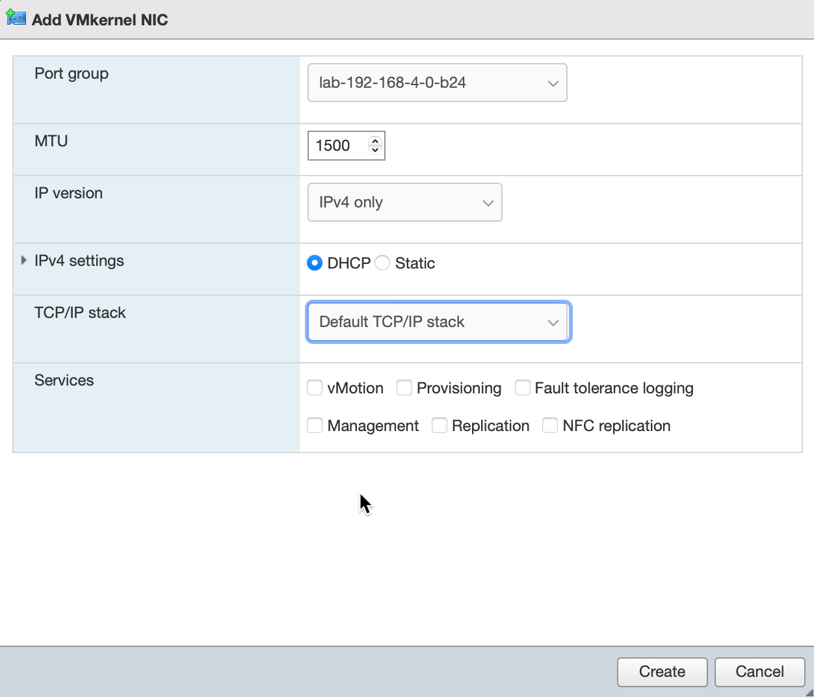
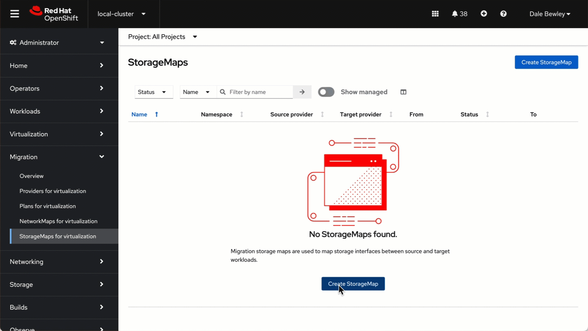

= Migrating Virtual Machines from VMware to OpenShift using MTV
:source-highlighter: rouge
:toc:

== Install the Migration Toolkit for Virtualization Operator

See https://red.ht/mtv-docs[Migration Toolkit for Virtualization] documentation.

* Install the MTV Operator

[source,bash]
----
$ oc apply -k operator/overlays/release-v2.5
namespace/openshift-mtv created
operatorgroup.operators.coreos.com/migration created
subscription.operators.coreos.com/mtv-operator created
----

* Ready the provider credentials in link:instance/base/secrets/[instance/base/secrets/].

* Create a Forklift resource to start MTV services

[source,bash]
----
$ oc apply -k instance/base
secret/provider-creds created
forkliftcontroller.forklift.konveyor.io/forklift-controller created
----

* Refresh the OpenShift web console and a new Migration item will appear.

* Confirm that multiple pods are running

[source,bash]
----
$ oc get pods -n openshift-mtv
NAME                                                    READY   STATUS    RESTARTS      AGE
forklift-api-56c46fddc8-n4tp8                           1/1     Running   0             2d6h
forklift-controller-7d9ccd7b7b-5mzq5                    2/2     Running   0             2d20h
forklift-must-gather-api-56d8d7b557-bkcpd               1/1     Running   0             2d6h
forklift-operator-686474b648-82ltz                      1/1     Running   7 (23h ago)   2d6h
forklift-ui-plugin-bf4f758dc-hxtfj                      1/1     Running   0             2d6h
forklift-validation-f74cd4446-wd9nz                     1/1     Running   0             2d6h
forklift-volume-populator-controller-5d8676b659-268zc   1/1     Running   0             2d20h
----

== Build a VDDK Container Image

To migrate from vSphere, a VDDK image will be required.
Since Red Hat may not distributed this software you will have to download it and build a container image as follows.

Download the https://developer.vmware.com/web/sdk/7.0/vddk[VMware VDDK] tar.gz file and place it in the link:vddk/[vddk] directory. The steps below will automatically build and push to the cluster registry once it is exposed.

=== Expose OpenShift Cluster Registry

You may optionally https://docs.openshift.com/container-platform/latest/registry/securing-exposing-registry.html[expose the OpenShift cluster image registry] to store the VDDK image built in the following steps.

[TIP]
If you do not expose the cluster registry, the VDDK image must be pushed to some other registry. You can do so by hand or using and the Makefile variables. The location must be updated in the `Provider` link:instance/overlays/lab/provider.yaml[provider.yaml].

* Deploy the registry if you have not yet. Eg `oc patch configs.imageregistry.operator.openshift.io cluster --type merge --patch '{"spec":{"managementState":"Managed"}}'`
* Expose the cluster registry and capture the URL

[source,bash]
----
oc patch configs.imageregistry.operator.openshift.io/cluster \
  --patch '{"spec":{"defaultRoute":true}}' --type=merge

export REGISTRY=$(oc get route default-route -n openshift-image-registry \
  --template='{{ .spec.host }}')
----

* Obtain a token for logging into the OpenShift registry.

[source,bash]
----
export REGISTRY_USER=builder # must not be 'system:admin'
export TOKEN=$(oc create token builder -n openshift-mtv)
----

* Login to the registry

[source,bash]
----
podman login -u $REGISTRY_USER -p $TOKEN $REGISTRY
----

* Build and push vddk image to OpenShift registry. See link:Makefile[Makefile]

[source,bash]
----
$ cd vddk

$ make image
podman build . -t vddk:7.0.3-20134304 && \
        podman tag vddk:7.0.3-20134304 default-route-openshift-image-registry.apps.hub.lab.bewley.net/openshift-mtv/vddk:7.0.3-20134304 && \
        podman tag vddk:7.0.3-20134304 default-route-openshift-image-registry.apps.hub.lab.bewley.net/openshift-mtv/vddk:latest
STEP 1/5: FROM registry.access.redhat.com/ubi9/ubi-minimal
STEP 2/5: USER 1001
--> f3f8d5c29999
STEP 3/5: COPY vmware-vix-disklib-distrib /vmware-vix-disklib-distrib
--> 88b2cfb0749d
STEP 4/5: RUN mkdir -p /opt
--> ed3ea3d5a946
STEP 5/5: ENTRYPOINT ["cp", "-r", "/vmware-vix-disklib-distrib", "/opt"]
COMMIT vddk:7.0.3-20134304
--> 9694359d833a
Successfully tagged localhost/vddk:7.0.3-20134304
9694359d833ac783ed9b667f6473d87599ae62f260e8e99fd6c0c66eadf2bfe5

$ make push
podman push --tls-verify=false default-route-openshift-image-registry.apps.hub.lab.bewley.net/openshift-mtv/vddk:latest
Getting image source signatures
Copying blob sha256:bf0ce923d07e7b91baffbe7030057e726fd22416a8a5b96e108252d9b2c1637c
Copying blob sha256:384af134a8247dff9ae87b7f10fcd8e7d07a02d3db9b55e0aaabcfe2f03aae7e
Copying blob sha256:a68b4dab593adf465d2dabe4c5e982585218d146114374c8bdcd2897f0063d88
Copying config sha256:9694359d833ac783ed9b667f6473d87599ae62f260e8e99fd6c0c66eadf2bfe5
Writing manifest to image destination

$ cd ..
----

== Create a VMware Provider
=== Using the Web UI

Browse to Migration -> Providers for virtualization and https://access.redhat.com/documentation/en-us/migration_toolkit_for_virtualization/2.4/html/installing_and_using_the_migration_toolkit_for_virtualization/migrating-vms-web-console#adding-providers[Create a VMware provider] by hand.

.Capture vCenter SHA1 Fingerprint
[IMPORTANT]
====
The provider will require the SHA1 fingerprint of the vCenter server certificate.

* Obtain the SHA-1 fingerprint for the vCenter certificate and optionally write this value to link:instance/base/secrets/thumbprint[instance/base/secrets/thumbprint]
[source,bash]
----
$ echo | openssl s_client -connect vcenter.lab.bewley.net:443 2>/dev/null -showcerts \
       | openssl x509 -fingerprint -sha1 -noout
SHA1 Fingerprint=C2:6C:23:AA:0A:EE:30:25:B5:7D:EE:31:24:28:E7:4A:78:3E:A2:01
----
====

* Edit the provider and correct the credentials and the certificate SHA-1 fingerprint if it is not already present.

Set the VDDK Init Image location to pull from the local image registry at `image-registry.openshift-image-registry.svc:5000/openshift-mtv/vddk:latest`

* Status should now be Ready.

* Optionally select a Migration Network for the 'host' provider used by MTV. The default Management Network should function.

// Needs more testing. Setting a Migration network explicitly does not seem to be necessary.
// .**TBD**
// [WARNING]
// When the vNIC had an IP OpenShift integration with vSphere failed. Need more testing.

// 

// 

// .**ESXi Connectivity**
// [TIP]
// Ensure the vSphere host can be reached on the chosen migration network.
// 

=== Using Kustomize or GitOps

Instead of of the web UI, you may use Kustomize and an overlay to create the VMware provider. See this link:instance/overlays/lab/provider.yaml[example provider.yaml]. Notice this overlay will also link:instance/overlays/lab/rolebinding.yaml[enable all other namespaces to pull the VDDK image] which was built in the openshift-mtv namespace.

* Create VMware provider

[source,bash]
$ oc apply -k instance/overlays/lab/
rolebinding.rbac.authorization.k8s.io/allow-image-pullers created
secret/provider-creds configured
forkliftcontroller.forklift.konveyor.io/forklift-controller unchanged
provider.forklift.konveyor.io/lab created

== Create Mappings from VMware to OpenShift Virt

=== Using the Web UI

Create storage and network mappings in the UI or using Kustomize

* Browse to Migration -> NetworkMaps for virtualization and https://access.redhat.com/documentation/en-us/migration_toolkit_for_virtualization/2.4/html/installing_and_using_the_migration_toolkit_for_virtualization/migrating-vms-web-console#creating-network-mapping_mtv[Create a network mapping] by hand.
* Browse to Migration -> StorageMaps for virtualization and https://access.redhat.com/documentation/en-us/migration_toolkit_for_virtualization/2.4/html/installing_and_using_the_migration_toolkit_for_virtualization/migrating-vms-web-console#creating-storage-mapping_mtv[Create a storage mapping] by hand.

=== Using Kustomize or GitOps

*  Create storage and network mappings using Kustomize

[source,bash]
----
$ oc apply -k instance/overlays/lab
rolebinding.rbac.authorization.k8s.io/allow-image-pullers created
secret/provider-creds created
forkliftcontroller.forklift.konveyor.io/forklift-controller unchanged
networkmap.forklift.konveyor.io/netmap created
provider.forklift.konveyor.io/lab created
storagemap.forklift.konveyor.io/storemap created
----

== Migrate a Virtual Machine

=== Create A Migration Plan

* Browse to Migration -> Plans for virtualization and 
https://access.redhat.com/documentation/en-us/migration_toolkit_for_virtualization/2.4/html/installing_and_using_the_migration_toolkit_for_virtualization/migrating-vms-web-console#creating-migration-plan_mtv[Create a migration plan] for a single VM to test.

image::img/mtv-25-plan.gif[]

=== Execute the Migration Plan

https://access.redhat.com/documentation/en-us/migration_toolkit_for_virtualization/2.4/html/installing_and_using_the_migration_toolkit_for_virtualization/migrating-vms-web-console#running-migration-plan_mtv

= Appendix

[source,make]
----
include::Makefile[]
----
