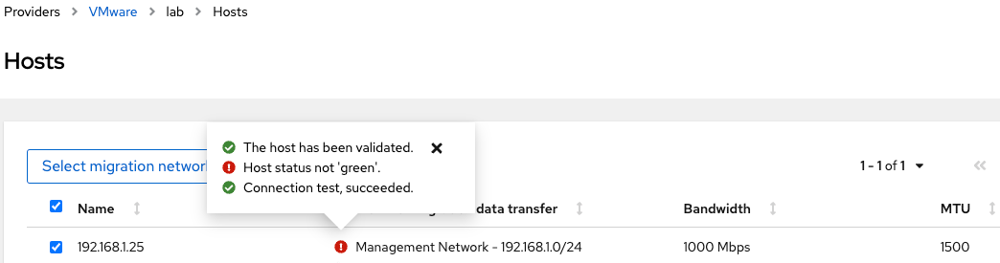

= Migrating Virtual Machines from VMware to OpenShift using MTV

https://red.ht/mtv-docs[Migration Toolkit for Virtualization]

== Steps

=== Install Migration Toolkit for Virtualization Operator

* Install and configure MTV Operator

[source,bash]
----
oc apply -k operator/overlays/release-v2.3
oc apply -k instance/base
oc get pods -n openshift-mtv
URL="https://$(oc get route virt -n openshift-mtv -o jsonpath='{.spec.host}')"
----

Visit $URL for the Migration Toolkit for Virtualization console.

=== Build Container Image

* Build a container image using the https://developer.vmware.com/web/sdk/7.0/vddk[VMware VDDK]

==== Expose OpenShift Cluster Registry

You may optionally https://docs.openshift.com/container-platform/latest/registry/securing-exposing-registry.html[expose the OpenShift cluster image registry] to store the VDDK image built in the following step.

[source,bash]
----
oc patch configs.imageregistry.operator.openshift.io/cluster --patch '{"spec":{"defaultRoute":true}}' --type=merge

REGISTRY=$(oc get route default-route -n openshift-image-registry --template='{{ .spec.host }}')

oc extract secret/router-certs-default -n openshift-ingress --keys=tls.crt --to=-

oc get secret -n openshift-ingress  router-certs-default -o go-template='{{index .data "tls.crt"}}' | base64 -d | sudo tee /etc/pki/ca-trust/source/anchors/${HOST}.crt  > /dev/null
----

* Build and push vddk image to OpenShift registry

[source,bash]
----
make push
----

=== Create a Provider

* Create a VMware provider

https://access.redhat.com/documentation/en-us/migration_toolkit_for_virtualization/2.3/html/installing_and_using_the_migration_toolkit_for_virtualization/migrating-vms-web-console#adding-source-provider_vmware

image:img/provider.png[]

* Select a Migration Network for a host in the vSphere cluster.

Right now this does not work

