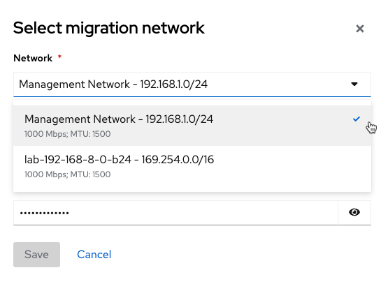

= Migrating Virtual Machines from VMware to OpenShift using MTV

https://red.ht/mtv-docs[Migration Toolkit for Virtualization]

== Install Migration Toolkit for Virtualization Operator

* Install and configure MTV Operator

[source,bash]
----
oc apply -k operator/overlays/release-v2.3
oc apply -k instance/base
----

* Confirm that multiple pods are running and obtain the URL to the MTV console

[source,bash]
----
oc get pods -n openshift-mtv
MTV_URL="https://$(oc get route virt -n openshift-mtv -o jsonpath='{.spec.host}')"
----

== Build VDDK Container Image

Download the https://developer.vmware.com/web/sdk/7.0/vddk[VMware VDDK] tar.gz file and build a container image. The steps below will automatically build and push to the cluster registry once it is exposed.

=== Expose OpenShift Cluster Registry

You may optionally https://docs.openshift.com/container-platform/latest/registry/securing-exposing-registry.html[expose the OpenShift cluster image registry] to store the VDDK image built in the following step.

If you do not expose the registry the image must be pushed to some other registry by hand.

* Expose the cluster registry

[source,bash]
----
oc patch configs.imageregistry.operator.openshift.io/cluster --patch '{"spec":{"defaultRoute":true}}' --type=merge

REGISTRY=$(oc get route default-route -n openshift-image-registry --template='{{ .spec.host }}')
----

* Obtain a token for logging into the OpenShift registry.

[source,bash]
TOKEN=$(oc whoami -t)

* Login to the registry

[source,bash]
podman login -u $(REGISTRY_USER) -p $(TOKEN) $(REGISTRY)

* Build and push vddk image to OpenShift registry. In imagstream in openshift-mtv named vddk will be created. See link:Makefile[Makefile]

[source,bash]
----
$ cd vddk
$ make push     
tar -xzf VMware-vix-disklib-7.0.3-20134304.x86_64.tar.gz
podman build . -t vddk:7.0.3-20134304 && \
        podman tag vddk:7.0.3-20134304 default-route-openshift-image-registry.apps.hub.lab.bewley.net/openshift-mtv/vddk:7.0.3-20134304 && \
        podman tag vddk:7.0.3-20134304 default-route-openshift-image-registry.apps.hub.lab.bewley.net/openshift-mtv/vddk:latest
STEP 1/5: FROM registry.access.redhat.com/ubi8/ubi-minimal
STEP 2/5: USER 1001
--> Pushing cache []:2572ce12921600e8830f348535a71cc29f6845033f71dc9d592058b5ffdddb83
--> 10d46650a61
STEP 3/5: COPY vmware-vix-disklib-distrib /vmware-vix-disklib-distrib
--> Pushing cache []:4270806f152267ee1eddea06ce02b0b2dbd8ba4b0cf49b3064d9361c2c19f778
--> 39a634a783f
STEP 4/5: RUN mkdir -p /opt
--> Pushing cache []:e3a3f0270e9bee59cd4c54713ad4913d23613ac83866a4cce1550ed9e4b021a4
--> 2f6bfce1786
STEP 5/5: ENTRYPOINT ["cp", "-r", "/vmware-vix-disklib-distrib", "/opt"]
COMMIT vddk:7.0.3-20134304
--> Pushing cache []:bf0b0ce02241c0f49b30d4fe70194d668efaf298a9c0e1a49bc05040b641a8e9
--> b190e360066
Successfully tagged localhost/vddk:7.0.3-20134304
b190e360066c56448b9e50d3454088c5d251b7011589e2d495c9264367e6bd64
podman login -u dlbewley -p sha256~token default-route-openshift-image-registry.apps.hub.lab.bewley.net
Login Succeeded!
podman push --tls-verify=false default-route-openshift-image-registry.apps.hub.lab.bewley.net/openshift-mtv/vddk:latest
Getting image source signatures
Copying blob sha256:7014d8c1d04a15acd0d1a260605aff972cb4af8ea243828e51bbc1ceb5978b72
Copying blob sha256:969795712c492f0c43031ce89dfb3d6ca2c08221fc28fb4479c7e0a370af7342
Copying blob sha256:f89b818fe84099f0ca2b536f672398b63b31e300c298ef303188a5ab85859a51
Copying config sha256:b190e360066c56448b9e50d3454088c5d251b7011589e2d495c9264367e6bd64
Writing manifest to image destination
Storing signatures
----

== Create a VMware Provider in MTV Console

Visit the `$MTV_URL` obtained above for the Migration Toolkit for Virtualization console to continue.

* https://access.redhat.com/documentation/en-us/migration_toolkit_for_virtualization/2.3/html/installing_and_using_the_migration_toolkit_for_virtualization/migrating-vms-web-console#adding-source-provider_vmware[Create a VMware provider]

image:img/provider.png[]

* Select a Migration Network for a host in the vSphere cluster.

.**Blocker**
[WARNING]
Right now this does not work in my lab.

image:img/migration-network.png[]

.**Fix**
[TIP]
Ah! After adding a VMkernel NIC on the network things are "super green" :lettuce: as Ruby Rhod in The Fifth Element would say.
image:img/add-vmkernel-nic.png[]

=== More steps

... tbd. see  link:instance/overlays/lab[instance/overlays/lab]