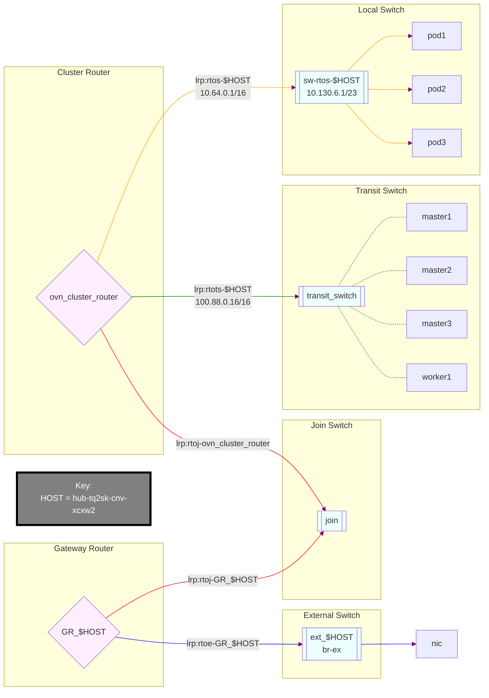

# OpenShift Virtualization Networking Diagrams

## OVS Bridge Localnet Topology Example

This method maps Network Attachment Definitions to an OVS Bridge via a Bridge Mapping. The bridge mapping is constructed by NNCP. The bridge may be the existing default br-ex or a custom bridge, eg. br-vmdata, constructed by NNCP. Packets entering the bridge from ens224 retain their 802.1q tags as they traverse the switch.

An OVS logical switch will be created (`ovn-nbctl ls-list`) with a logical switch port for the bridge and for each of the pod network interfaces (`ovn-nbctl lsp-list vmdata_ovn_localnet_switch`).


The network name as found in the NAD.spec.config.name is used as the selector to identify the appropriate bridge for a given network via the bridge mapping.

The `name` in the config of a Network Attachment Definition defines "a network". Any NADs which grant access to this "network" must be the same. The name of the NAD its self is only consequential when assigning it to an interface via Multus.

<!-- https://dompl.medium.com/produce-great-looking-flowcharts-in-seconds-7f3bea64f2e2 -->
<!-- 
ovncli hub-tq2sk-cnv-qt59g
sh-5.1# ovn-nbctl ls-list
b126a387-8cf2-42be-a214-5a853b8929ec (ext_hub-tq2sk-cnv-qt59g)
0efe6d8d-0ddf-4128-9ca1-a6ecbe77e063 (hub-tq2sk-cnv-qt59g)
014427a8-b291-4b9a-98e6-cb503aca2fca (isolated_ovn_layer2_switch)
282f5c3f-1ec1-426b-949e-6642197b3411 (join)
5343e6cd-34b5-41fc-9f13-2a7590e7efed (transit_switch)
b30b5253-7fe4-46a4-b74f-d21845c773c5 (vlan.1924_ovn_localnet_switch)
4b795783-2692-42d0-be2b-4bb760a16b8d (vlan.1926_ovn_localnet_switch) -->

<!-- ```mermaid
gantt
axisFormat %
todayMarker on
section Node Network Config
    Switch Port : TA, 0, 1d
    NIC Config : TB, after TA, 1d
section Network Attachment 1924
    NAD : TC, after TB, 1d
    NNCP : TD, after TC, 1d
section Network Attachment 1926
    NAD : TE, after TB, 1d
    NNCP : TF, after TE, 1d
``` -->


## Linux Bridge VLAN Filtering Example

This method treats the linux bridge as if it were a physical switch. Packets entering the bridge from ens224 retain their 802.1q tags as they traverse the switch.

Veth ports added to the bridge for pods can optionally retain or strip the VLAN tags upon egress from the bridge.


## VLAN Interface Example

This example peels VLANs off the NIC to define an interface per VLAN. Then a bridge is creatd for each VLAN. Traffic entering this bridge is already untagged.

This may have a positive impact on efficiency of traffic between pods on this same VLAN as they will avoid tagging and untagging. It is a more complex configuration.


## More OVN Spelunking

Trying to visualize the OVN components on a node

```
osh-5.1# ovn-nbctl lr-list
65edf48e-8e56-4cbb-a55d-54ca2b96cb04 (GR_hub-tq2sk-cnv-xcxw2) # <-- routing off the cluster (gatway)
99aba237-a6ed-4a91-9b5d-eaf9dcc4878c (ovn_cluster_router) # <-- routing within the cluster

sh-5.1# ovn-nbctl ls-list
d77c4a1a-d128-44f8-8698-3236384917f1 (ext_hub-tq2sk-cnv-xcxw2) # <-- br-ex and GR
d4222ecf-7a0d-47be-9cd0-cd14e9e3eba9 (hub-tq2sk-cnv-xcxw2)
a0c4ae72-db54-4ac0-a4c0-dd1f7a65855b (join) #
238fbbad-b6a3-474b-9944-6c0f99c5191b (transit_switch)
8a4631c6-f1fa-4eec-aa7c-00f88e85f439 (vlan.1924_ovn_localnet_switch) # guess
5047e67e-d8b6-483f-8718-c38468205e24 (vlan.1926_ovn_localnet_switch) # guess

sh-5.1# ovn-nbctl lsp-list ext_hub-tq2sk-cnv-xcxw2
3007e1e2-0d26-46da-a5a5-b2d5c97dfc77 (br-ex_hub-tq2sk-cnv-xcxw2)
0ddee1da-4102-4f54-935a-e96fb994d147 (etor-GR_hub-tq2sk-cnv-xcxw2)

sh-5.1# ovn-nbctl lrp-list ovn_cluster_router
553af3a3-4663-445a-a1a1-5bbd86219a82 (rtoj-ovn_cluster_router)
0ab8b4a0-2250-4252-a7d9-ea8405cfe921 (rtos-hub-tq2sk-cnv-xcxw2)
d51c8aa7-84be-40cf-876b-8174d35852d0 (rtots-hub-tq2sk-cnv-xcxw2)

sh-5.1# ovn-nbctl show ovn_cluster_router
router 99aba237-a6ed-4a91-9b5d-eaf9dcc4878c (ovn_cluster_router)
    port rtos-hub-tq2sk-cnv-xcxw2
        mac: "0a:58:0a:82:06:01"
        networks: ["10.130.6.1/23"]
        gateway chassis: [f57f0c4e-5d93-4639-a016-7cea61281c04]
    port rtoj-ovn_cluster_router
        mac: "0a:58:64:40:00:01"
        networks: ["100.64.0.1/16"]
    port rtots-hub-tq2sk-cnv-xcxw2
        mac: "0a:58:64:58:00:10"
        networks: ["100.88.0.16/16"]

sh-5.1# ovn-nbctl lrp-list GR_hub-tq2sk-cnv-xcxw2
c06389bb-e92f-499e-8c86-4b64e711ac43 (rtoe-GR_hub-tq2sk-cnv-xcxw2)
6c5ac19f-56af-4ac0-9b03-21cf14081434 (rtoj-GR_hub-tq2sk-cnv-xcxw2)

sh-5.1# ovn-nbctl show GR_hub-tq2sk-cnv-xcxw2
router 65edf48e-8e56-4cbb-a55d-54ca2b96cb04 (GR_hub-tq2sk-cnv-xcxw2)
    port rtoj-GR_hub-tq2sk-cnv-xcxw2
        mac: "0a:58:64:40:00:10"
        networks: ["100.64.0.16/16"]
    port rtoe-GR_hub-tq2sk-cnv-xcxw2
        mac: "00:50:56:b4:76:06"
        networks: ["192.168.4.45/24"]
    nat 00380db1-95ad-4a34-b1db-ff134af85a34
        external ip: "192.168.4.45"
        logical ip: "10.130.6.97"
        type: "snat"
        ... many more nat objects ...
```




  <!-- subgraph vlan-1924["Localnet Switch 1924"]
    sw-1924[["vlan.1924_ovn_localnet_switch"]]
    sw-1924 -- vm
    rt-cluster -- lrp:?? -- sw-1924
  end
 -->

## Examples

[Network components](../demos/components/networks)

## References

* <https://kubevirt.io/2023/OVN-kubernetes-secondary-networks-localnet.html>
* <https://access.redhat.com/solutions/6972064>
* <https://developers.redhat.com/blog/2017/09/14/vlan-filter-support-on-bridge#without_vlan_filtering>

```

## Examples

[Network components](../demos/components/networks)

## References

* <https://kubevirt.io/2023/OVN-kubernetes-secondary-networks-localnet.html>
* <https://access.redhat.com/solutions/6972064>
* <https://developers.redhat.com/blog/2017/09/14/vlan-filter-support-on-bridge#without_vlan_filtering>
