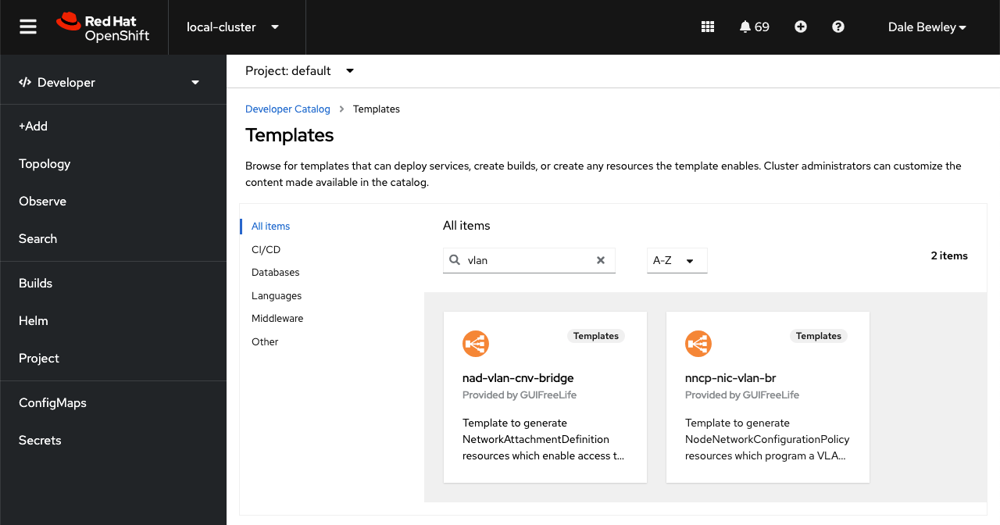
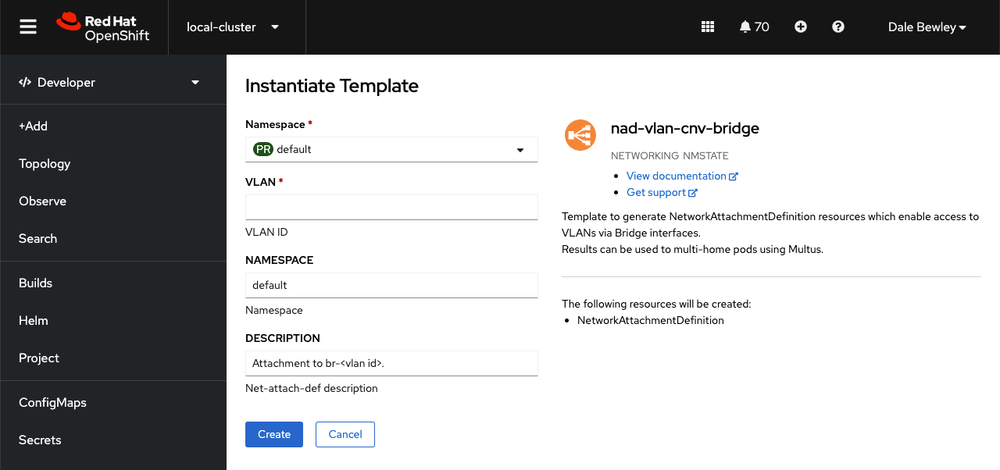

= Templates for creation of network or virtualization resources

== CLI Usage

Generate static resources to store in git for application via GitOps. 

.Example NNCP creation from template on CLI
[source,bash]
----
oc process -f templates/template-nncp-nic-br-vmdata.yaml \
  -p NIC=ens224 \
  -p NODE_SELECTOR_KEY=machine.openshift.io/cluster-api-machineset \
  -p NODE_SELECTOR_VALUE=hub-tq2sk-cnv \
  -o yaml \
  | yq e '.items[0]' - > nncp-ens224-br-vmdata.yaml
----

.Example NAD creation from template on CLI 
[source,bash]
----
oc process -f templates/template-nad-br-cnv-bridge-vlan.yaml \
  -p VLAN=1924 \
  -p DESCRIPTION="Lab Network 192.168.4.0/24 V1924" \
  -o yaml \
  | yq e '.items[0]' > nad-vlan-1924.yaml
----

See link:../demos/components/networks[components/networks] outputs.

== Developer Catalog

Install these templates in openshift namespace, and use them in the Developer Console. 

